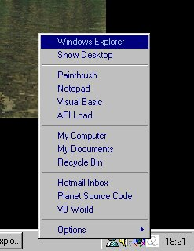



## Quick Menu \(Advanced use of INI files\!\)

### Description

QuickMenu is basically a tray icon that, when you click on it, pops up a handy menu with some shortcuts.

You don't need to modify the menus in the code, it's all in an .ini file (modified in by the program), so instead of having a folder full of shortcut files like most quick menus do, you have a list of shortcuts (where you can modify the name using ANY characters you want and use all the commands available in "Start Menu -> Execute"), with a very easy-to-use interface!

Also features: you can modify the tray icon's image to your own and use separators to better organise your QuickMenu!

Please vote, I worked a lot on this!
 
### More Info
 

             |
---                |---
**Submitted On**   |2000-09-25 15:01:52
**By**             |[Jotaf98](https://github.com/Planet-Source-Code/PSCIndex/blob/master/ByAuthor/jotaf98.md)
**Level**          |Intermediate
**User Rating**    |4.9 (54 globes from 11 users)
**Compatibility**  |VB 4\.0 \(32\-bit\), VB 5\.0, VB 6\.0
**Category**       |[Complete Applications](https://github.com/Planet-Source-Code/PSCIndex/blob/master/ByCategory/complete-applications__1-27.md)
**World**          |[Visual Basic](https://github.com/Planet-Source-Code/PSCIndex/blob/master/ByWorld/visual-basic.md)
**Archive File**   |[CODE\_UPLOAD102139272000\.zip](https://github.com/Planet-Source-Code/jotaf98-quick-menu-advanced-use-of-ini-files__1-11714/archive/master.zip)

